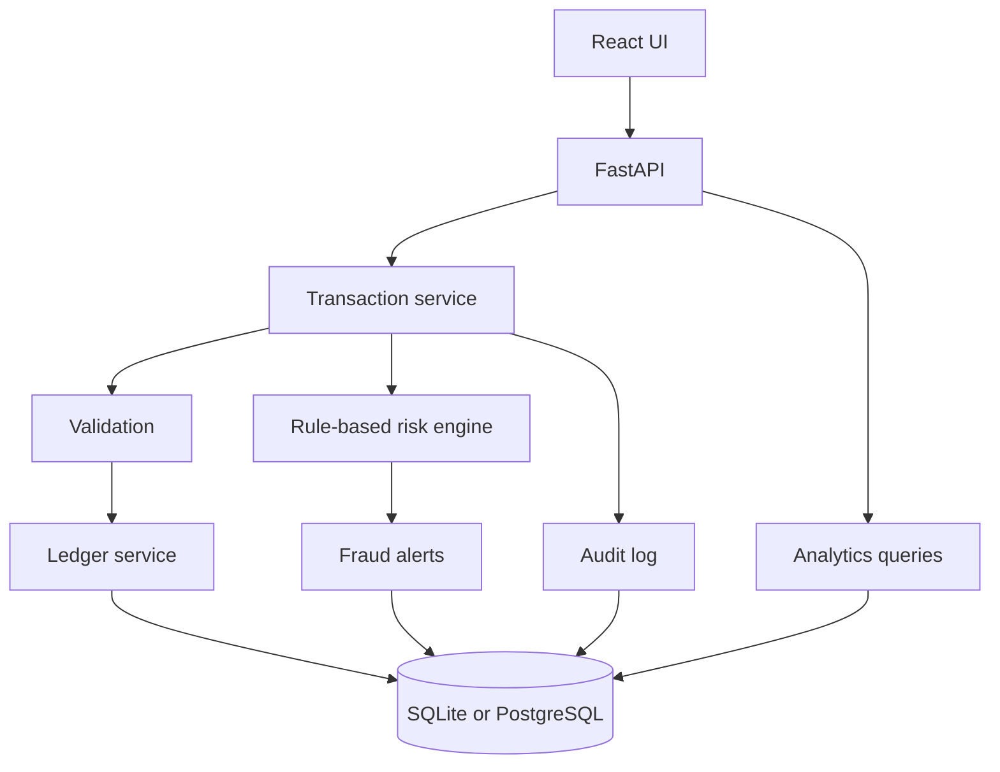
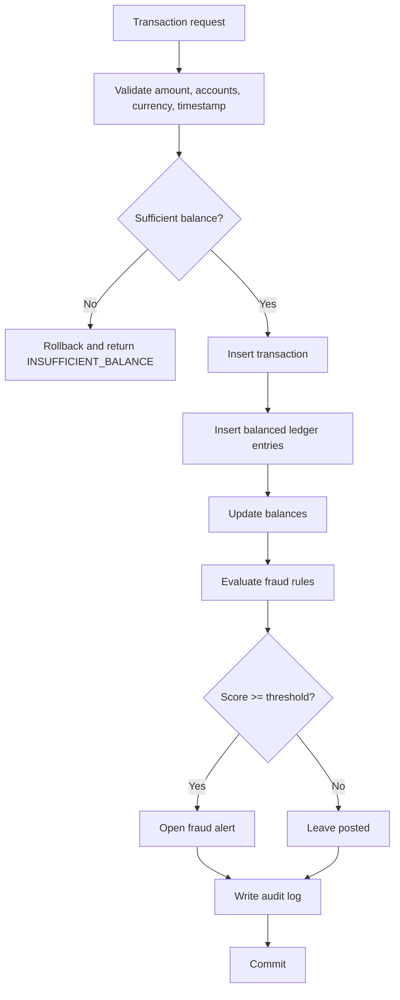
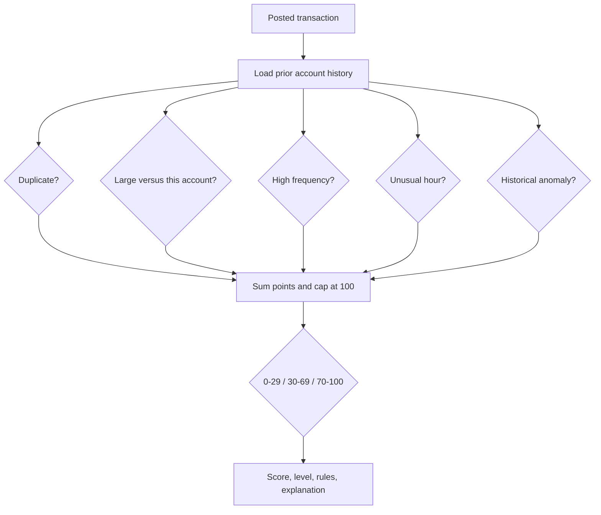

# Architecture

FinSight is a single backend service and a single-page frontend.



The frontend calls Axios services under `frontend/src/api`. Pages render loading, empty, and error states. They do not hardcode dashboard totals.

A financial operation commits only after validation, ledger lines, balance updates, risk evaluation, optional alert creation, and audit rows succeed. `create_transaction` rolls the session back on any exception.

PostgreSQL takes row locks with `SELECT ... FOR UPDATE` while locking account ids in sorted order. SQLite relies on the database transaction around the same sequence.

## Transaction processing



## Fraud detection



## Repository layout

```text
backend/app
  api/            HTTP routes
  core/           config, database, money type, errors
  models/         SQLAlchemy models
  schemas/        request models
  services/       ledger, transactions, fraud, analytics, csv, audit
  seed.py         demo data through the services
frontend/src
  api/            Axios clients
  components/     layout, badges, states, modal
  pages/          dashboard, accounts, transactions, alerts, analytics, audit, settings
docs/             architecture, schema, fraud, API, tests
```
