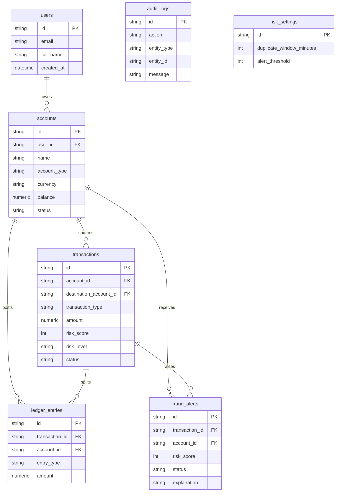

# Database schema

Money columns use SQLAlchemy `Numeric(14, 2)` and are read back as `Decimal` quantized to cents. Floating point is not used for balances or amounts.

## Posting rules

- `CREDIT`: credit the customer account and debit External Settlement (`ACC-SETTLEMENT`).
- `DEBIT`: debit the customer account and credit External Settlement.
- `TRANSFER`: debit the source account and credit the destination account.

Settlement is a `SYSTEM` account. It can go negative because it represents cash coming into the customer ledger. Customer accounts cannot. The sum of every account balance, including settlement, stays at zero after a successful posting. The sum of ledger debits equals the sum of ledger credits.

Opening balances are credits in category `OPENING_BALANCE`. They update the ledger and the balance, and they are excluded from fraud history, volume, and analytics so a large opening balance does not look like fraud.

Indexes cover account ids, transaction timestamps, merchants, risk level, alert status, and audit time. Transaction and ledger amounts have a check constraint that the amount is positive.

The API creates tables on startup with `Base.metadata.create_all`. There is no Alembic revision history yet.
